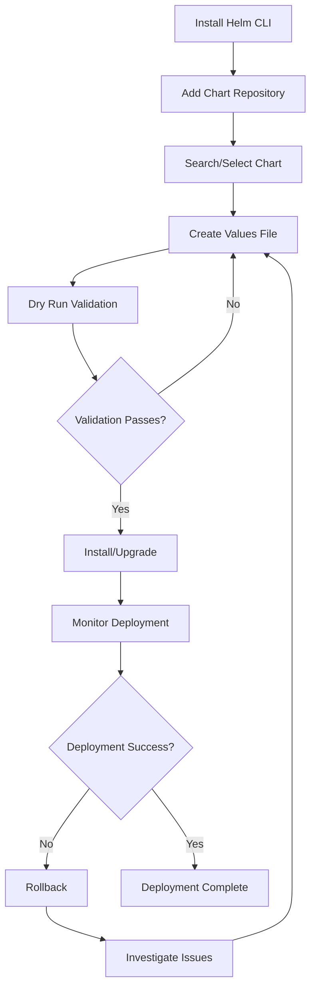

# Helm Commands Reference

## 🎯 Complete Helm Documentation Structure

### Individual Topic Files:
1. **[Install Helm CLI](1.%20Install-Helm-CLI.md)** - Installing and configuring Helm CLI
2. **[Commands](2.%20Commands.md)** - `helm list`, `helm get values`, `helm history`
3. **[Understanding Chart Structure](3.%20Understanding-Chart-Structure.md)** - Chart.yaml, values.yaml, templates/
4. **[Helm Upgrade With File](4.%20Helm-Upgrade-With-File.md)** - `helm upgrade -f values.yaml`
5. **[Helm Upgrade Set Values](5.%20Helm-Upgrade-Set-Values.md)** - `helm upgrade --set key=value`
6. **[Helm Rollback](6.%20Helm-Rollback.md)** - `helm rollback` operations
7. **[Dry Runs](7.%20Dry-Runs.md)** - `helm upgrade --dry-run --debug`
8. **[Practice](8.%20Practice.md)** - Deploy a chart, modify values, upgrade, and rollback

## ✅ Learning Progression

- [ ] **Install Helm CLI**: Set up Helm and verify installation
- [ ] **Commands**: Master helm list, helm get values, helm history
- [ ] **Understanding chart structure**: Chart.yaml, values.yaml, templates/
- [ ] **helm upgrade -f values.yaml**: Upgrade using configuration files
- [ ] **helm upgrade --set key=value**: Set individual values during upgrades
- [ ] **helm rollback**: Recovery from failed deployments
- [ ] **Dry runs**: helm upgrade --dry-run --debug for safe validation
- [ ] **Practice**: Deploy a chart, modify values, upgrade, and rollback

## 🎯 Key Features:

1. **Command-focused**: Each file centers on specific Helm operations
2. **Practical examples**: Real commands you can copy and paste
3. **Comprehensive practice**: Hands-on exercises for each topic
4. **Quick references**: Summary tables and workflows
5. **Troubleshooting guides**: Common issues and solutions
6. **Progressive learning**: From installation to advanced practices

## 🚀 Getting Started

1. **Start with basics**: Begin with [1. Install-Helm-CLI.md](1.%20Install-Helm-CLI.md)
2. **Progress systematically**: Follow the numbered order above
3. **Practice as you go**: Use [8. Practice.md](8.%20Practice.md) to reinforce learning
4. **Check off items**: Mark completed checkboxes as you master each command set

## 📖 How to Use This Guide

### For Beginners:
1. Start with 1. Install-Helm-CLI.md
2. Learn basic commands with 2. Commands.md
3. Understand chart structure with 3. Understanding-Chart-Structure.md
4. Practice deployments with 4. Helm-Upgrade-With-File.md

### For Chart Management:
1. Read 3. Understanding-Chart-Structure.md to understand chart organization
2. Learn 4. Helm-Upgrade-With-File.md for configuration management
3. Master 5. Helm-Upgrade-Set-Values.md for dynamic updates
4. Study 7. Dry-Runs.md for safe validation practices

### For Operations:
1. Master 6. Helm-Rollback.md for failure recovery
2. Practice with 8. Practice.md scenarios
3. Implement validation with 7. Dry-Runs.md
4. Build operational scripts and procedures

## 🛠️ Helm Workflow Overview

## 📊 Command Quick Reference

| Operation | Command | Purpose |
|-----------|---------|---------|
| **Install** | `helm install name chart` | Deploy new application |
| **List** | `helm list` | Show all releases |
| **Status** | `helm status name` | Check release status |
| **Upgrade** | `helm upgrade name chart -f values.yaml` | Update with values file |
| **Set Values** | `helm upgrade name chart --set key=value` | Update specific values |
| **History** | `helm history name` | View release history |
| **Rollback** | `helm rollback name revision` | Revert to previous version |
| **Dry Run** | `helm upgrade name chart --dry-run` | Validate without applying |

## 🎯 Learning Paths

### Quick Start (30 minutes)
1. Install Helm CLI
2. Deploy first application
3. Perform basic upgrade
4. Practice rollback

### Comprehensive (2-3 hours)  
1. Complete all 8 documentation files
2. Practice all scenarios in Practice.md
3. Build automation scripts
4. Implement best practices

### Expert Level (1 day)
1. Master all Helm operations
2. Create custom charts
3. Implement CI/CD integration
4. Advanced troubleshooting

## 🚨 Important Notes

### Before You Begin:
- ✅ Ensure you have access to a Kubernetes cluster
- ✅ Install kubectl and verify cluster connection
- ✅ Have appropriate RBAC permissions
- ✅ Understand basic Kubernetes concepts

### Safety Reminders:
- ✅ Always use --dry-run before production deployments
- ✅ Backup configurations before major upgrades
- ✅ Test changes in non-production environments first
- ✅ Monitor applications after deployments
- ✅ Have rollback procedures documented

## 📚 Additional Resources

### Official Documentation:
- [Helm Official Docs](https://helm.sh/docs/)
- [Helm Charts Hub](https://artifacthub.io/)
- [Kubernetes Documentation](https://kubernetes.io/docs/)

### Best Practices:
- Use semantic versioning for charts
- Implement proper value validation
- Document chart configurations
- Follow security best practices
- Implement proper testing procedures

## 🎓 Certification Path

After mastering these concepts, consider:
- **Kubernetes Administrator (CKA)** certification
- **Kubernetes Security Specialist (CKS)** certification  
- **Cloud provider specific** certifications
- **DevOps and GitOps** certifications

## 📞 Support and Community

- [Helm Slack](https://slack.k8s.io/) - Join #helm-users channel
- [GitHub Issues](https://github.com/helm/helm/issues) - Report bugs or request features
- [Stack Overflow](https://stackoverflow.com/questions/tagged/kubernetes-helm) - Ask questions
- [CNCF Community](https://community.cncf.io/) - Cloud Native Computing Foundation

---

Happy Helming! 🚀 Start with [1. Install-Helm-CLI.md](1.%20Install-Helm-CLI.md) and work through each numbered guide to build your Helm expertise.