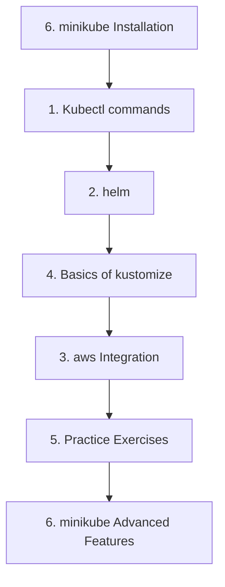

# 🚀 Kubernetes DevOps Learning Environment

A comprehensive workspace for mastering Kubernetes, DevOps tools, and cloud-native development workflows using minikube as the foundation.

## 📚 Complete Learning Path

This workspace provides a structured journey from Kubernetes fundamentals to advanced enterprise-grade implementations:

### [1. Kubectl commands](1.%20Kubectl%20commands)
**Kubernetes CLI Fundamentals**
- Master essential kubectl operations for pod, service, and deployment management
- Understand Kubernetes resource manipulation and debugging techniques
- Learn advanced kubectl features for troubleshooting and optimization

### [2. helm](2.%20helm) 
**Application Packaging and Deployment**
- Package applications using Helm charts with templating and values
- Manage application lifecycles with upgrades, rollbacks, and releases
- Implement best practices for Helm chart development and distribution

### [3. aws](3.%20aws)
**Cloud Integration and Services** 
- Integrate Kubernetes with AWS services (EKS, CloudWatch, IAM)
- Configure cloud-native logging, monitoring, and storage solutions
- Implement AWS-specific networking and security patterns

### [4. Basics of kustomize](4.%20Basics%20of%20kustomize)
**Configuration Management**
- Master declarative configuration management with Kustomize
- Implement environment-specific overlays and patches
- Learn advanced Kustomize patterns for multi-environment deployments

### [5. Practice](5.%20Practice)
**Hands-on Exercises Combining All Tools**
- **6 Comprehensive Practice Exercises** covering the complete DevOps workflow:
  1. **Deploy Application Using Helm** - Complete Helm deployment workflows
  2. **Update ConfigMap via kubectl** - Dynamic configuration management  
  3. **Modify Helm Values and Upgrade** - Safe upgrade procedures with rollback
  4. **Use Kustomize for Environment-Specific Configs** - Advanced configuration management
  5. **Monitor Deployment via CloudWatch Logs** - Comprehensive monitoring and observability
  6. **Debug Issues Using kubectl Logs** - Advanced troubleshooting and log analysis

### [6. minikube](6.%20minikube) ⭐ **NEW**
**Complete Local Kubernetes Development Environment**
- **5 Comprehensive Guides** covering basic to enterprise-level minikube usage:
  1. **Installation and Setup** - Cross-platform installation and configuration
  2. **Basic Commands** - Essential operations and management
  3. **Multi-Profile Management** - Environment isolation and automation
  4. **Networking and Ingress** - Advanced networking and service exposure
  5. **Advanced Features and Add-ons** - Enterprise-grade monitoring, security, and CI/CD

## 🎯 What You'll Master

### **Core Kubernetes Skills**
- Complete kubectl command mastery
- Pod, service, and deployment lifecycle management
- Advanced troubleshooting and debugging techniques
- Resource management and optimization

### **DevOps Toolchain**
- Helm chart development and management
- Kustomize configuration patterns
- CI/CD pipeline integration
- Infrastructure as Code practices

### **Cloud-Native Development**
- Local development with minikube
- Cloud integration patterns (AWS)
- Monitoring and observability stack
- Security and compliance implementation

### **Production Readiness**
- Multi-environment configuration management
- Automated deployment workflows
- Performance monitoring and optimization
- Security hardening and RBAC implementation

## 🚀 Key Features

### **Comprehensive Coverage**
- **35+ detailed markdown files** with extensive technical depth
- **5,000-8,000+ words per major guide** with production-ready examples
- **Complete automation scripts** for setup and management
- **Real-world scenarios** and enterprise patterns

### **Practical Implementation**
- **Ready-to-run scripts** for all major operations
- **Multi-environment workflows** (development, staging, production-like)
- **Security-focused configurations** with best practices
- **Performance monitoring** and optimization techniques

### **Enterprise Features**
- **Multi-tenant networking** with proper isolation
- **Comprehensive observability** stack (Prometheus, Grafana, EFK)
- **CI/CD pipeline integration** (Tekton, GitOps workflows)
- **Advanced storage management** with multiple storage classes
- **Security policy implementation** (RBAC, PSP, Network Policies)

## 🛠️ Getting Started

### Prerequisites
- **System Requirements**: 4+ CPU cores, 8GB+ RAM, 50GB+ free disk space
- **Software**: Docker, kubectl, minikube
- **Operating System**: Windows, macOS, or Linux

### Quick Start
1. **Set up minikube**: Follow [6. minikube/1. Installation-and-Setup.md](6.%20minikube/1.%20Installation-and-Setup.md)
2. **Learn kubectl basics**: Start with [1. Kubectl commands](1.%20Kubectl%20commands)
3. **Practice workflows**: Work through [5. Practice](5.%20Practice) exercises
4. **Advanced features**: Explore enterprise patterns in [6. minikube/5. Advanced-Features-and-Add-ons.md](6.%20minikube/5.%20Advanced-Features-and-Add-ons.md)

### Recommended Learning Path

## 📊 Advanced Capabilities

### **Local Development Environment**
- **Multi-profile management** for different environments
- **Local registry** with UI for image management
- **Ingress controller** with SSL/TLS termination
- **Service mesh integration** (Istio) for advanced networking

### **Monitoring and Observability**
- **Prometheus + Grafana** monitoring stack
- **EFK logging** infrastructure (Elasticsearch, Fluentd, Kibana)
- **Distributed tracing** with Jaeger
- **Custom metrics** and alerting configuration

### **Security and Compliance**
- **Pod Security Policies** and security contexts
- **RBAC implementation** with fine-grained permissions
- **Network policies** for micro-segmentation
- **Multi-tenant isolation** patterns

### **CI/CD Integration**
- **Tekton Pipelines** for cloud-native CI/CD
- **GitOps workflows** with automated deployment
- **Ephemeral environments** for testing
- **Integration testing** automation

## 🎓 Learning Outcomes

After completing this workspace, you'll be able to:

✅ **Deploy and manage** production-ready Kubernetes applications  
✅ **Implement** comprehensive monitoring, logging, and security  
✅ **Design** multi-environment deployment workflows  
✅ **Integrate** cloud services with Kubernetes clusters  
✅ **Troubleshoot** complex Kubernetes issues effectively  
✅ **Optimize** application performance and resource utilization  
✅ **Secure** clusters with industry best practices  
✅ **Automate** deployment pipelines with CI/CD tools  

## 📈 Next Steps

### **Expand Your Skills**
- **Multi-cluster management** with cluster federation
- **Advanced service mesh** patterns and observability
- **Kubernetes operators** development
- **Custom resource definitions** (CRDs) and controllers

### **Production Migration**
- **EKS, GKE, AKS** cloud migration strategies
- **Production hardening** and security scanning
- **Disaster recovery** and backup strategies
- **Cost optimization** and resource governance

## 🤝 Contributing

This workspace is designed for continuous learning and improvement. Each directory contains:
- **Comprehensive documentation** with examples
- **Automation scripts** for hands-on practice
- **Troubleshooting guides** for common issues
- **Best practices** and production patterns

## 📝 License

This educational content is provided for learning purposes. All Kubernetes, Helm, AWS, and related trademarks belong to their respective owners.

---

**Happy Learning! 🚀**

Start your journey with minikube installation and work your way through the complete DevOps toolchain to become a Kubernetes expert.